### *0x00 引言*
&emsp;&emsp;`Nvidia Jetson AGX Orin`板子是非常适合用来训练AI的，但是由于内置的Ubuntu系统并不是官方的，因此刷系统需要使用Nvidia提供的`SDK-Manager`。

### *0x01 准备工作*
&emsp;&emsp;开始刷机之前，需要准备以下内容：
- Jetson AGX Orin 64GB Developer Kit
- Ubuntu PC机（用于安装SDK-Manager）
- Type-C转USB线（用于PC机通过USB给AGX刷系统）

&emsp;&emsp;Jetson不同板子的算力和配置参数，供选板子时参考：

<div align=center>
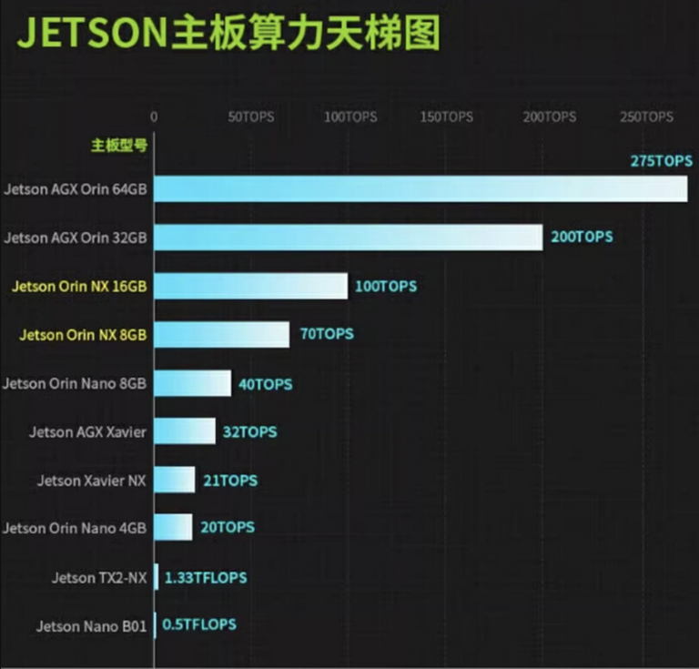
</div align=left>  

### *0x02 PC机安装SDK-Manager*

```
1 注册Nvidia
2 下载SDK-Manager
```

***1、注册Nvidia***  
&emsp;&emsp;由于下载`SDK-Manager`需要用到Nvidia的账号，所以需要先保证有已在[官网注册](https://developer.nvidia.com/)，且注意注册地址不要选中国，否则后续登录`SDK-Manager`时会有地域限制导致无法登录。

***2、下载SDK-Manager***  
&emsp;&emsp;在注册完成后，可通过[官网地址](https://developer.nvidia.com/sdk-manager)下载`SDK-Manager`。

<div align=center>
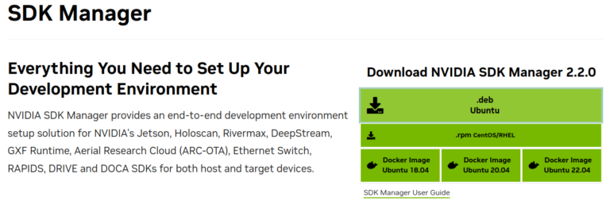
</div align=left>  

```sh
$ sudo apt install ./sdkmanager_1.9.1-10844_amd64.deb
$ sudo apt-get update
```

&emsp;&emsp;安装完成后，在应用列表里面找到并打开，然后登录自己的账号。

<div align=center>
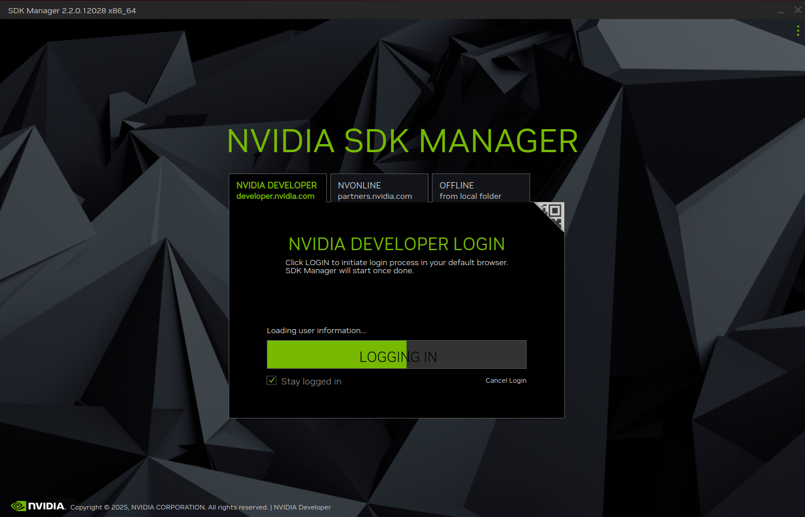
</div align=left>  

### *0x03 板卡识别*
&emsp;&emsp;PC机需要与AGX通过USB线进行串口通信，且AGX需要进入Recover模式。

**串口连接**  
&emsp;&emsp;我们先用Type-C转USB线连接PC机与AGX：

<div align=center>
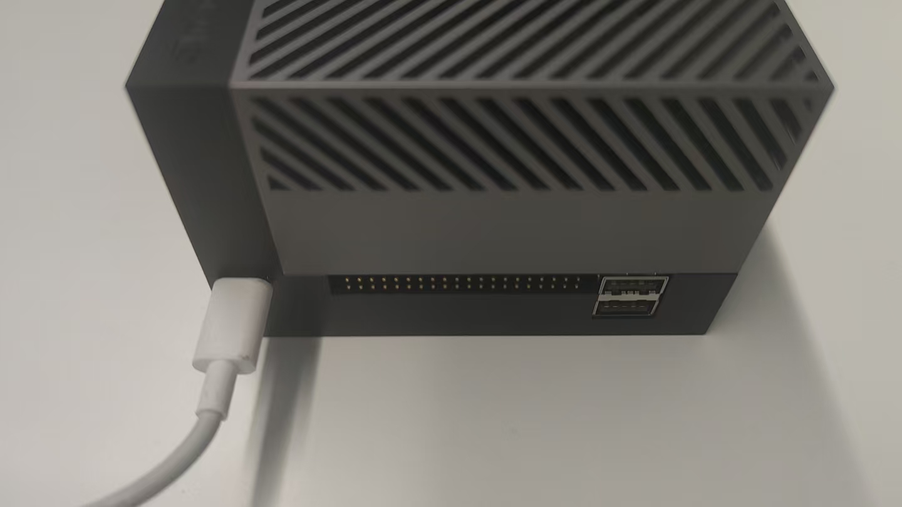
</div align=left>  

**AGX进入Recover模式**  

<div align=center>
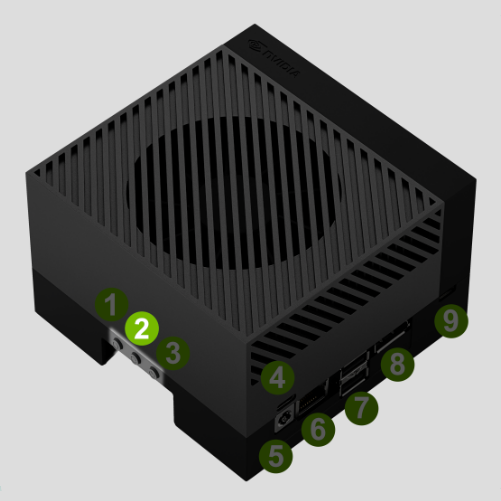
</div align=left>  

- 按住Force Recovery按钮（2）先不松开
- 接入电源
- 等待白灯亮起后，松开Force Recovery按钮（2）

**串口连接**  
&emsp;&emsp;在PC机上检查是否存在NVIDIA的设备，如有则可以确认Orin已进入刷机模式：

```sh
$ lsusb
    Bus 001 Device 008: ID 0955:7020 NVIDIA Corp. 
```

### *0x04 系统刷写*

```
1 AGX型号选择
2 配置选择
3 烧录系统镜像
4 配置系统源
5 烧录组件
6 失败组件重装
```

***1、AGX型号选择***  
&emsp;&emsp;在登录`SDK-Manager`后，需要选择指定的AGX型号，具体型号可在AGX机身内侧找到：

<div align=center>
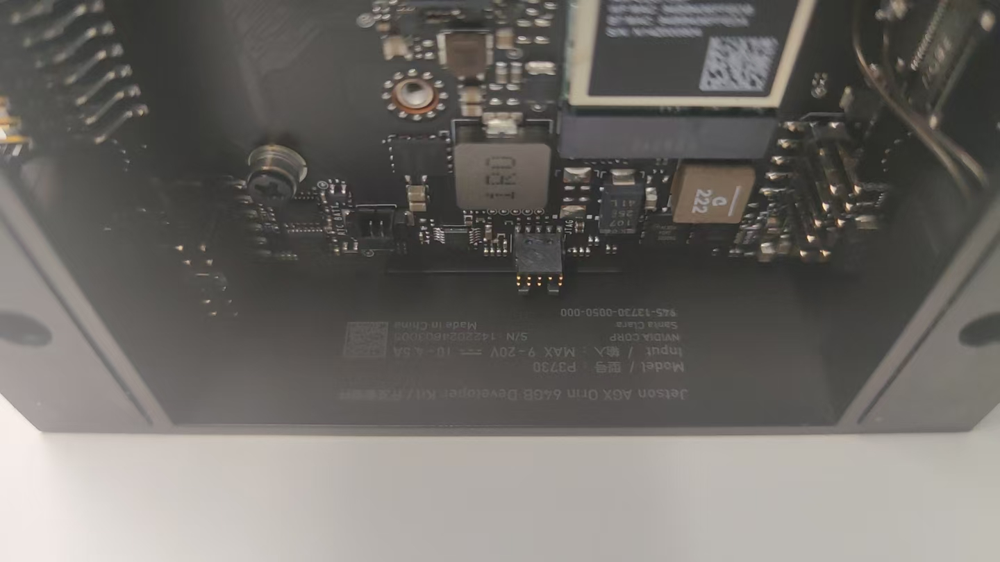
</div align=left>  

&emsp;&emsp;然后在`SDK-Manager`中选择对应AGX型号即可。

<div align=center>
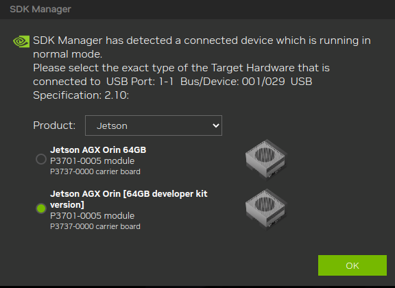
</div align=left>  

***2、配置选择***  
&emsp;&emsp;JetPack版本信息可在[官网查询](https://developer.nvidia.com/embedded/jetpack-archive)。由于后续需要安装`ROS2 Humble`，因此这里选择`JetPck 6.0(rev.2)`。

<div align=center>
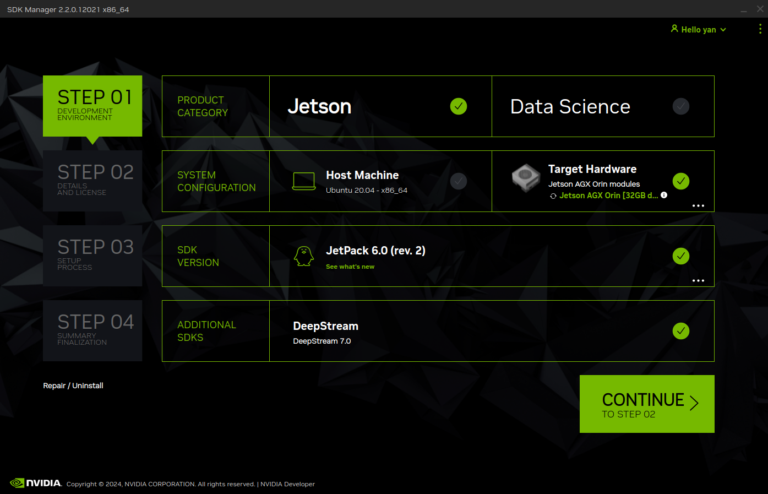
</div align=left>  

&emsp;&emsp;根据自己的需要，选择需要安装的内容（一般来说直接勾选所有）。

<div align=center>
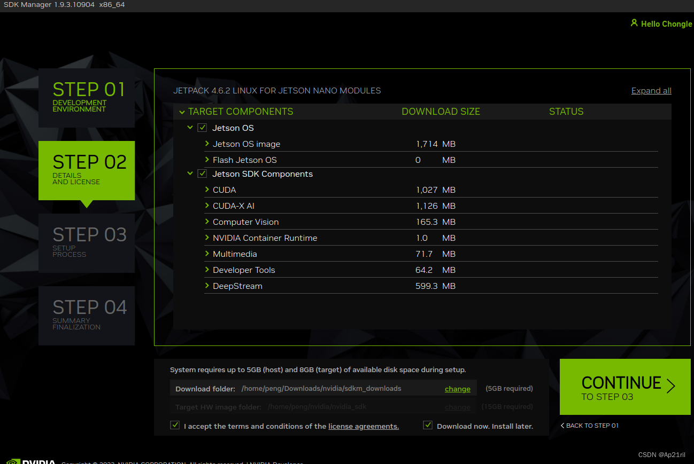
</div align=left>  

***3、烧录系统镜像***  
&emsp;&emsp;配置选择完成后，继续会下载安装包到本地。

<div align=center>
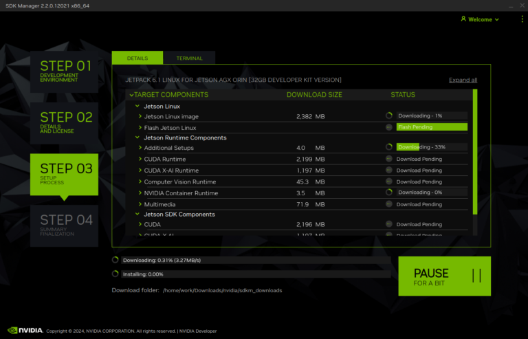
</div align=left>  

&emsp;&emsp;全部下载完成后，会提醒你输入新系统的账号与密码，点击"Flash"后即可烧录镜像。

<div align=center>
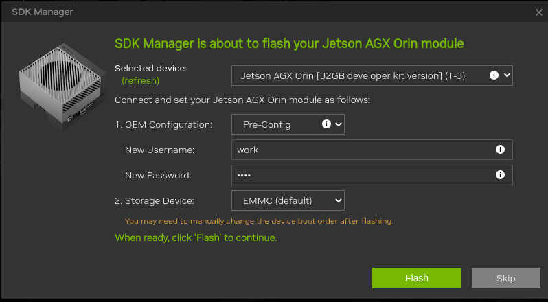
</div align=left>  

***4、配置系统源***  
&emsp;&emsp;系统烧录完成后，AGX会重启并进入系统安装引导界面，正常安装即可。此时，`SDK-Manager`会进入到Components安装等待界面，在此之前，我们需要先配置新系统的源(加快部分Components下载速度)。

```sh
# 源更换为国内清华源
# ！！！注意这里一定不能选择“清理第三方源”，我们选择“仅更换系统源”
$ wget http://fishros.com/install -O fishros && . fishros

# 增加hosts(通过终端ping指定网址找到对应IP)
$ sudo vim /etc/hosts
`
xx.xx.xx.xx  www.nvidia.com
xx.xx.xx.xx  developer.nvidia.com
`
```

***5、烧录组件***  
&emsp;&emsp;回到PC机，继续Components的安装，点击"Install"。

<div align=center>
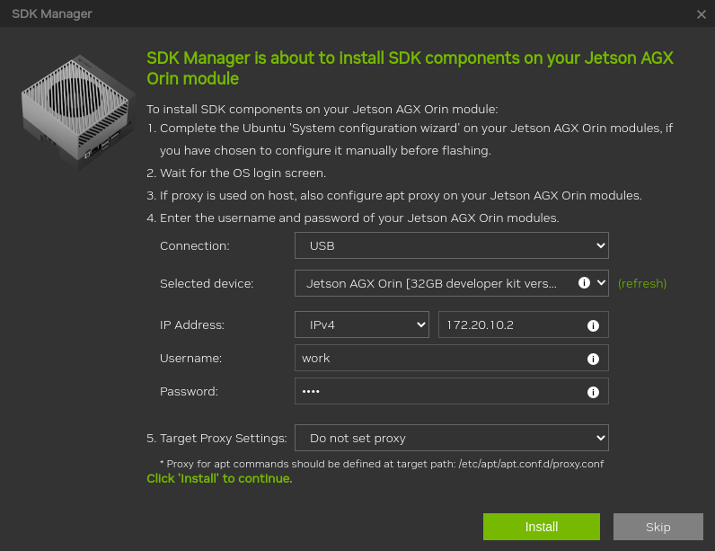
</div align=left>  

&emsp;&emsp;安装顺利的话，会显示下述界面。

<div align=center>
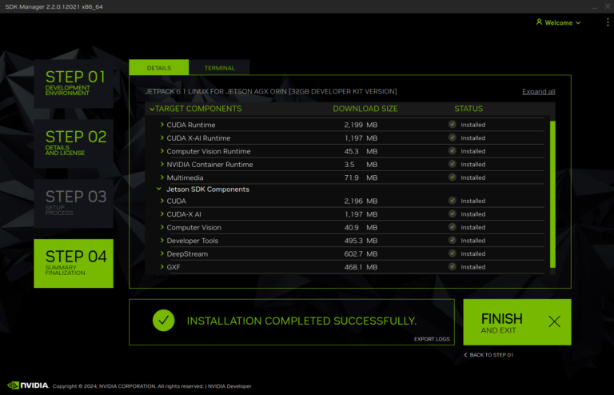
</div align=left>  

***6、失败组件重装***  
&emsp;&emsp;如果在上一步中，没有顺利安装完成所有组件，则会显示下述界面。

<div align=center>
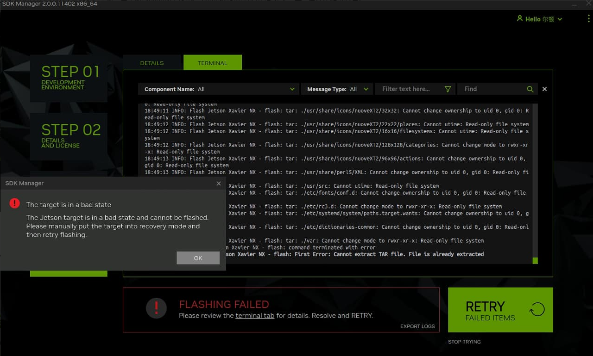
</div align=left>  

&emsp;&emsp;注意此处不要点击"Retry"，而是重启AGX和`SDK-Manager`，在STEP-01中只勾选前面安装失败的SDK组件。
